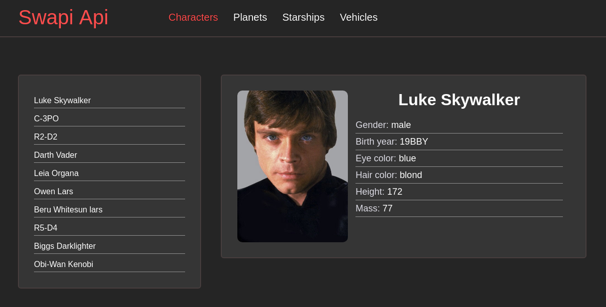

# StarWars


## About Project
Project use a base data from service swapi.dev to show details information about character, planets and transport from a universe Star Wars.

## List of technologies
- Java Script
- React
- Webpack

## For starting use this application you should initialize a project

1. First of all, move to directory where you want to see this repo, with command in a terminal:

```zsh
cd $HOME/path/to/your-folder
```

2. Then in the terminal copy this repo with command:
```zsh
git clone https://github.com/Mirhaydarov/StarWars.git
```

3. And initial project:
```zsh
cd StarWars
npm i
```

4. For start app use command:
```zsh
npm run start
```

5. For build project in product mode:
```zsh
npm run build
```

More commands you can find in root project directory in file __package.json__ to section "scripts".
